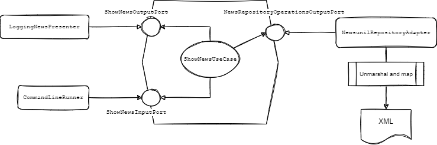

Challenge: Java, 2022(a), senior-level
---

This GitHub repository contains the source code and the instructions for a challenge to be submitted by candidats 
for a senior-level Java developer/analyst position at the University of Lausanne (DSM-DEV-INT division).

:warning: **Important**: Please, do not fork this repository or publish your solution to this challenge anywhere. 
If you are reading this, it means that you have been contacted personally by a member of DSM-DEV-INT team with specific 
instructions of how to submit your solution.

This edition of the challenge first appeared for a job posted in the year 2022.

### Pre-requisits and preliminary reading

In order to complete the challenge you just need:
- JDK v. 17 ([Temurin edition](https://adoptium.net/temurin/releases/), for example)
- Maven v. 3.5.3 or later
- IDE of your choice (IntelliJ is strongly recommended for its outstanding refactoring capabilities)

Please, refresh your memory concerning the concepts related to Hexagonal and Clean Architecture. Here is a list of most
important sources to consult:
- [The Clean Architecture](https://blog.cleancoder.com/uncle-bob/2012/08/13/the-clean-architecture.html), by Robert C. Martin
- [DDD, Hexagonal, Onion, Clean, CQRS, … How I put it all together](https://herbertograca.com/2017/11/16/explicit-architecture-01-ddd-hexagonal-onion-clean-cqrs-how-i-put-it-all-together/), by Herberto Graça
- [Question and discussion about use cases](https://softwareengineering.stackexchange.com/questions/357052/clean-architecture-use-case-containing-the-presenter-or-returning-data)

Also, please pay special attention to the `FIXME` comments in the various places in the source code.

**IntelliJ IDE, generated sources**

Please note that if you are using IntelliJ IDE, you may need to specify `target/generated/src/main/java` directory a root
directory for generated sources. This is the directory where the generated JAXB binding will be placed by the
`cxf-xjc-plugin`.

### News processing application

This challenge refers to a hypothetical news processing application which uses a small collection of actual news items from
the news portal running in production here at UNIL. Please, take your time to explore the code.

As you can see, the application is a working Spring Boot application which simply lists all the news items in the console 
during the launch. The news are stored as XML fies using a proprietary format and parsed using JAXB XML to Java bindings.
Here is an example of the program's output when it is executed as is (before any changes):

```
2022-04-29 12:48:47.709  INFO 46852 --- [           main] c.u.j.NewsProcessingApplication          : No active profile set, falling back to 1 default profile: "default"
2022-04-29 12:48:48.323  INFO 46852 --- [           main] c.u.j.NewsProcessingApplication          : Started NewsProcessingApplication in 0.845 seconds (JVM running for 1.296)
2022-04-29 12:48:48.324  INFO 46852 --- [           main] c.u.j.NewsProcessingApplication          : [Application] Executing the use case for each piece of news...
2022-04-29 12:48:48.344  INFO 46852 --- [           main] c.u.j.changeme.LoggingNewsPresenter      : [Output] Here are the news: News(id=1, title=Guerres civiles et révolutions)
2022-04-29 12:48:48.351  INFO 46852 --- [           main] c.u.j.changeme.LoggingNewsPresenter      : [Output] Here are the news: News(id=2, title=VQ: je suis musicienne et cheffe d'orchestre)
2022-04-29 12:48:48.356  INFO 46852 --- [           main] c.u.j.changeme.LoggingNewsPresenter      : [Output] Here are the news: News(id=3, title=CINQ A SEPT «Les infirmier·e·s praticien·ne·s spécialisé·e·s (IPS)»)
```

The implementation relies on the nomenclature and the ideas behind Hexagonal and Clean Architecture principles. The overall architecture diagram
is as follows:



This challenge will consist of several parts. For an experienced Java developer, familiar with Spring Boot framework, this
challenge should not take more than a day of work including any related research.

### Part 1: Repackage

In this part, your task is **to move** all the classes from `changeme` package to `core` and `infrastructure` packages creating
any sub-packages in the process which you may need. The overall package structure should reflect the ideas and conventions 
behind Hexagonal, Clean, and Screaming Architecture paradigmes.

Please, note that there is an ArchUnit test: `HexagonalArchitectureTest.java` which must pass after you have completed your
work on repackaging.

Please, provide, in the space below, any remarks or explanations related to your solution of the task for this part of
the challenge.

---

_Space reserved for your comments, part 1._
Le diagramme de flux qui est dans la description aide beaucoup.


---

### Part 2: Unit test

In this part, your task is to write **a unit test** for the use case implemented in `ShowNewsUseCase.java`. For this you
should use:
- JUnit 5
- Mockito

Please, note that all the libraries are already available (see `spring-boot-starter-test` dependency).

### Part 3: Externalize properties

In this part, your task is to externalize some configuration. In `Jaxb2MarshallerConfig.java` and 
`NewsunilRepositoryAdapter.java` there some configurable properties to be created:
- the path to the generated JAXB bindings (also see `newsunil.jaxb.package` POM property)
- the path to the XSD schema used by the unmarshaller for validation
- the path to the directory where XML files are stored

### Part 4: REST endpoint

In this part, your task is to write a simple REST endpoint which will return a JSON representation of a piece of news when executing 
a GET request to `/news/{id}`.

These are some points to keep in mind when you work on this task:

- You should probably use `spring-boot-starter-web` starter (adding the necessary dependencies in the POM).
- Your solution should comply with the principles of Hexagonal and Clean Architecture.
- You **must use the existing use case** (in `ShowNewsUseCase.java`) as is, without changing the use case's implementation or signature.

Please, provide, in the space below, any remarks or explanations related to your solution for this part of the challenge.

---

_Space reserved for your comments, part 4._

---

### Part 5: Discussion

In this part, please, give your opinion about the following points. 

- As you have noticed, the use case (`ShowNewsUseCase.java`) is retrieved from the application context as a prototype
scoped bean. What do you think are the advantages, if any, of working with use cases as Spring Bean components?
- In the use case (`ShowNewsUseCase.java`), the _Presenter_ is being called with `News` (model) instance. Does that seem fully 
compatible with Clean Architecture principles to you? If not, how could you have implemented this differently? Please, be specific 
and feel free to refer to the references listed above.
- What do you think about exception handling, see `GenericNewsError.java`, the use case and the _Presenter_? Do you find this
as an adequate solution? What would you differently?

---

_Space reserved for your comments, part 5._

---

### Conclusion

We thank you for your feedback and your interest in the position here at the university. Best of luck.